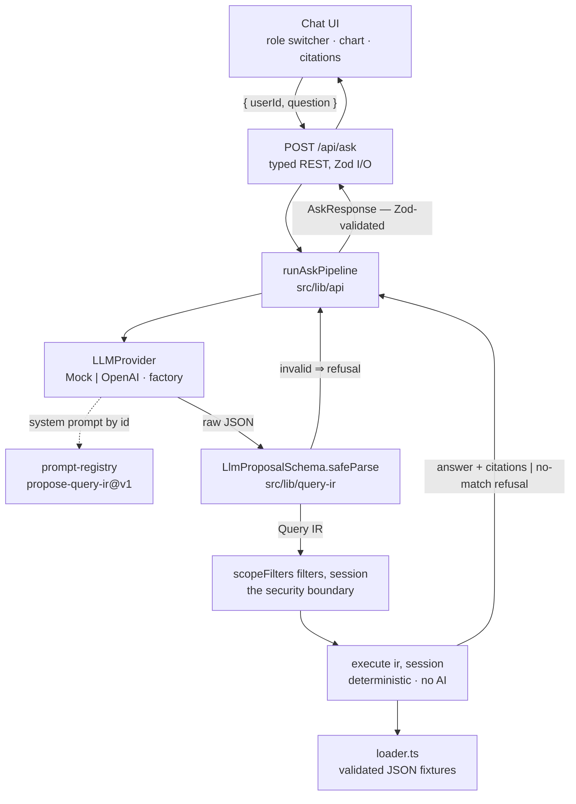
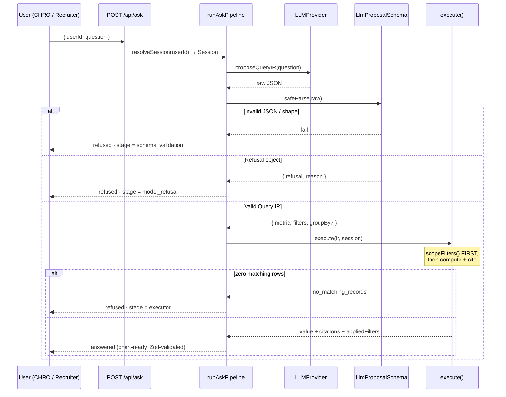
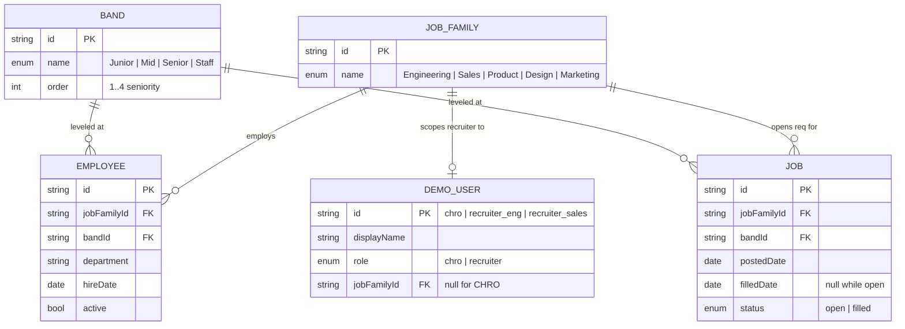

# Ask Your Hiring Data

A read-only, natural-language analytics assistant over a synthetic hiring dataset.

A user asks a plain-English question. One LLM call turns it into a small, **schema-validated
Query IR** — a structured object, never SQL and never free-form code. A deterministic executor
(plain TypeScript, no AI) validates that object, applies **server-side role scoping** from the
selected principal, computes the answer directly from the seeded dataset, and returns a grounded,
chart-ready result **with citations** (the exact record ids and fields it counted). Out-of-scope,
ambiguous, unsupported, or no-match questions get an **explicit refusal**, never a fabricated
answer.

> **The load-bearing decision:** the LLM is only ever allowed to _propose_ a structured object.
> It never executes anything. A separate, deterministic function is the only code path that
> touches the dataset, and role scoping is enforced there — not in the prompt.

## Branches

- **`assessment-core`** (this branch) — matches the take-home brief exactly and runs from a
  clean clone with `pnpm install && pnpm dev`, no database, no secrets. Three demo principals
  (CHRO / two recruiters) via an in-UI switcher.
- **`saas-model`** — the same core taken further into a hosted multi-tenant product: real auth,
  Postgres, per-org seeded datasets, a redesigned UI. Needs a database to run.

## Architecture



- **`src/lib/query-ir`** — the closed, versioned Zod contract. `z.strictObject` everywhere, so
  an injected key is a hard parse error. Fixed metric menu: `hire_count`, `open_reqs`,
  `headcount`, `avg_time_to_fill`, `headcount_by_band`.
- **`src/lib/executor`** — `execute(ir, session)`. `scopeFilters()` first, then metric, then
  citations; a distinct `no_matching_records` failure for "valid query, zero rows".
- **`src/lib/llm`** — `LLMProvider` interface, deterministic `MockProvider`, real
  `OpenAIProvider` (auto-selected when `OPENAI_API_KEY` is set), a factory. Never called from
  execution logic.
- **`src/lib/prompt-registry`** — prompts by stable id (`propose-query-ir@v1`), never inline.
- **`src/lib/api`** — `runAskPipeline` + the `POST /api/ask` request/response contract, both
  Zod-validated.
- **`src/lib/eval-runner`** — the 18-case set + runner (shared with `tests/eval.test.ts`).

### Request flow



### Data model

The synthetic dataset (JSON fixtures, regenerated by `pnpm seed`, validated against
`DatasetSchema` at load). Job family is the unit a recruiter is scoped to.



## Getting started

```bash
pnpm install
pnpm dev            # http://localhost:3000  →  /  landing,  /app  the assistant
```

The chat workspace is at **`/app`** — a collapsible sidebar (renamable history) and a
role switcher in the footer (CHRO / two recruiters) that drives which principal each
question runs as.

No API key required — the app, tests, and eval suite run on a deterministic `MockProvider`.
To use the real model:

```bash
cp .env.example .env.local        # set OPENAI_API_KEY=...
```

The provider factory picks it up automatically; `.env.local` is git-ignored.

## Prerequisites

- **Node.js `>=20.9`** — pinned in [`.nvmrc`](.nvmrc).
- **pnpm** via Corepack: `corepack enable pnpm` (version pinned in `package.json`).

## Scripts

| Command                             | What it does                                        |
| ----------------------------------- | --------------------------------------------------- |
| `pnpm dev`                          | Run the app in development mode                     |
| `pnpm build` / `pnpm start`         | Production build / serve                            |
| `pnpm lint`                         | ESLint                                              |
| `pnpm format` / `pnpm format:check` | Prettier write / check                              |
| `pnpm typecheck`                    | `next typegen` + `tsc --noEmit`                     |
| `pnpm test` / `pnpm test:watch`     | Vitest (unit tests + the eval suite as a CI gate)   |
| `pnpm eval`                         | The Q&A eval suite with a readable pass/fail report |
| `pnpm seed`                         | Regenerate the synthetic dataset fixtures           |

## CI

`.github/workflows/ci.yml` runs `format:check → lint → typecheck → test → eval → build` on every
push and PR. No secrets — everything runs on the in-memory dataset and `MockProvider`.

## License

MIT — see [LICENSE](LICENSE).
