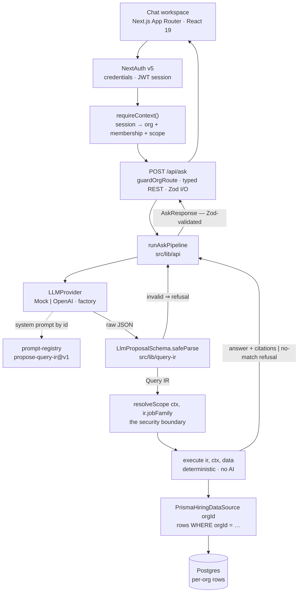
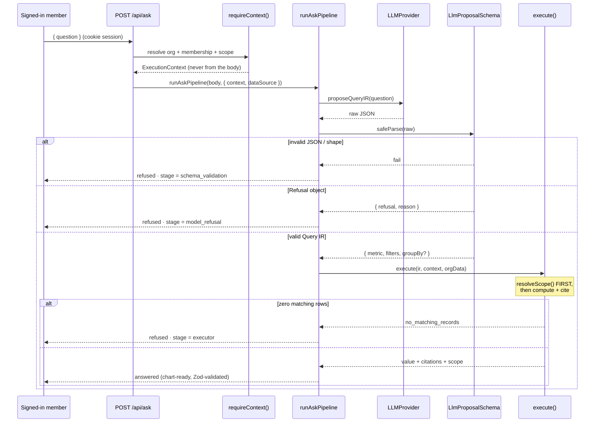
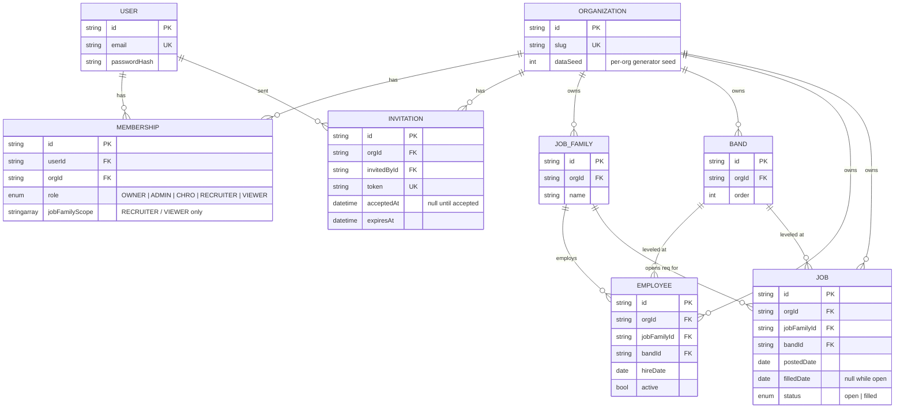

# Ask Your Hiring Data

A read-only, natural-language analytics assistant over a hiring dataset — built as a small
multi-tenant SaaS. You ask a plain-English question; you do not build or read a dashboard.

One LLM call turns the question into a small, **schema-validated Query IR** — a structured
object, never SQL and never free-form code. A deterministic executor (plain TypeScript, no AI)
validates that object, applies **server-side job-family scoping** from the signed-in member's
role, computes the answer directly from that organization's seeded data, and returns a grounded,
chart-ready result **with citations** (the exact record ids and fields it counted). Out-of-scope,
ambiguous, unsupported, or no-match questions get an **explicit refusal**, never a fabricated
answer.

> **The load-bearing decision:** the LLM only ever _proposes_ a structured object. It never
> executes anything and never sees another tenant's rows. A separate deterministic function is
> the only code path that touches data, and role scoping is enforced there — not in the prompt.

## Branches

- **[`assessment-core`](../../tree/assessment-core)** — the version that matches the take-home
  brief exactly and runs from a clean clone with just `pnpm install && pnpm dev` (no database,
  no secrets, three demo principals via an in-UI switcher). Its own `PROCESS.md` and CI live
  there. **Start here to evaluate the graded checklist.**
- **`main`** (this branch) — the same IR / executor / scoping / eval core, taken further into a
  hosted multi-tenant product: NextAuth v5, Postgres, per-org seeded datasets, RBAC, a
  redesigned UI. Needs a Postgres database to run the app; `pnpm test` and `pnpm eval` still run
  offline.

## Architecture



- **Query IR** (`src/lib/query-ir`) — a closed, versioned Zod contract. Fixed metric menu
  (`hire_count`, `open_reqs`, `headcount`, `avg_time_to_fill`, `headcount_by_band`), fixed
  filter shape, `z.strictObject` everywhere so an injected key is a hard parse error.
- **Executor** (`src/lib/executor`) — `execute(ir, context, data)`. Applies scope first, rejects
  filters a metric can't honor, computes the number, cites the rows and fields it used, and
  returns a distinct `no_matching_records` failure for "well-formed but zero rows".
- **Pipeline** (`src/lib/api`) — `runAskPipeline`: parse request → provider → parse proposal →
  execute → present as a validated `AskResponse` (also validated on the way out).
- **Tenancy** (`src/lib/tenancy`) — `requireContext()` resolves the session into a user, their
  org, membership + permissions, an `ExecutionContext`, and an **org-bound** `HiringDataSource`.
- **RBAC** (`src/lib/rbac`) — a role → permission-set map; nothing checks a role name directly.

  | Role        | Analytics          | Members / org settings  |
  | ----------- | ------------------ | ----------------------- |
  | `OWNER`     | org-wide           | full, incl. delete      |
  | `ADMIN`     | org-wide           | invite / roles / remove |
  | `CHRO`      | org-wide           | —                       |
  | `RECRUITER` | their job families | —                       |
  | `VIEWER`    | their job families | —                       |

- **Data** — `InMemoryHiringDataSource` (a seeded deterministic generator; used by tests, the
  eval gate, and offline dev — no DB) or `PrismaHiringDataSource` (one org's rows from Postgres).
  Both validate their output against `OrgHiringDataSchema` before the executor sees it.

### Request flow



### Data model



## Run it without a database

Tests and the eval suite are fully offline — deterministic generator + `MockProvider`, no
network, no secrets:

```bash
pnpm install
pnpm test        # unit + integration tests (DB tests auto-skip)
pnpm eval        # the 18-case Q&A eval suite, readable pass/fail
```

## Run the app

Needs a Postgres database. The project is wired for **Supabase** (any Postgres works).

1. **Create a Supabase project.** In the dashboard: _Connect → ORMs → Prisma_. Copy the two
   connection strings.
2. **Configure `.env.local`:**

   ```bash
   cp .env.example .env.local
   ```

   | Variable         | Value                                                                 |
   | ---------------- | --------------------------------------------------------------------- |
   | `DATABASE_URL`   | Transaction pooler (port `6543`), append `?pgbouncer=true` — the app  |
   | `DIRECT_URL`     | Session pooler (port `5432`) — migrations only                        |
   | `AUTH_SECRET`    | `openssl rand -base64 33`                                             |
   | `OPENAI_API_KEY` | Optional. Unset ⇒ deterministic `MockProvider` (zero cost, zero net). |

3. **Migrate and run:**

   ```bash
   pnpm db:migrate      # prisma migrate dev — creates the schema
   pnpm dev             # http://localhost:3000
   ```

4. **Sign up.** Creating a workspace provisions an OWNER membership and **seeds that org its own
   synthetic hiring dataset** (deterministic from a per-org seed). Sign in and start asking.

## Scripts

| Command                             | What it does                                                |
| ----------------------------------- | ----------------------------------------------------------- |
| `pnpm dev`                          | Dev server (webpack — see PROCESS.md for why not Turbopack) |
| `pnpm build` / `pnpm start`         | Production build / serve                                    |
| `pnpm lint`                         | ESLint                                                      |
| `pnpm format` / `pnpm format:check` | Prettier write / check                                      |
| `pnpm typecheck`                    | `next typegen` + `tsc --noEmit`                             |
| `pnpm test` / `pnpm test:watch`     | Vitest                                                      |
| `pnpm eval`                         | Q&A eval suite with a readable pass/fail report             |
| `pnpm db:migrate`                   | `prisma migrate dev`                                        |
| `pnpm db:deploy`                    | `prisma migrate deploy` (CI / prod)                         |
| `pnpm db:studio`                    | Prisma Studio                                               |
| `pnpm db:reset`                     | Drop + re-migrate (destructive)                             |

## Layout

```
src/
  app/                 Next.js App Router — /, /login, /signup, /app, /api/*
  components/           chat workspace, sidebar, answer visuals, auth screens
  lib/
    query-ir/           the LLM's only permitted output shape (Zod)
    executor/           deterministic execute() + resolveScope() security boundary
    llm/                LLMProvider interface, MockProvider, OpenAIProvider, factory
    api/                runAskPipeline + the request/response contract
    hiring-data/        generator, record schema, in-memory + Prisma sources
    rbac/               permissions, can() / assertPermission()
    tenancy/            signup, requireContext, member management, per-org seeding
    auth/               NextAuth v5 (credentials, JWT sessions)
    eval-runner/        eval-set.json + runner (shared with tests/eval.test.ts)
prisma/                 schema.prisma, migrations
.github/workflows/ci.yml   format · lint · types · test · eval · build (no secrets)
```

## CI

`.github/workflows/ci.yml` runs the full gate on every push to `main` and every PR:
`format:check → lint → typecheck → test → eval → build`. It needs **no secrets** — the eval
suite and tests use the in-memory generator and mock provider, and the Prisma client is
constructed lazily so `build` never opens a connection.

## License

MIT — see [LICENSE](LICENSE).
