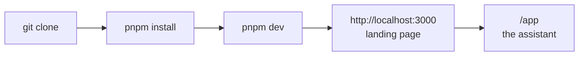
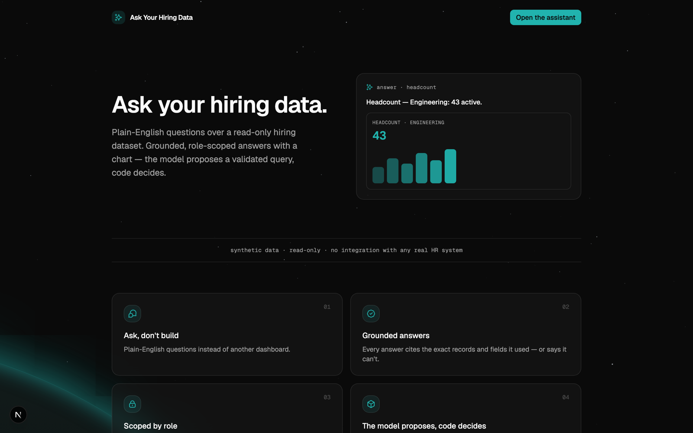
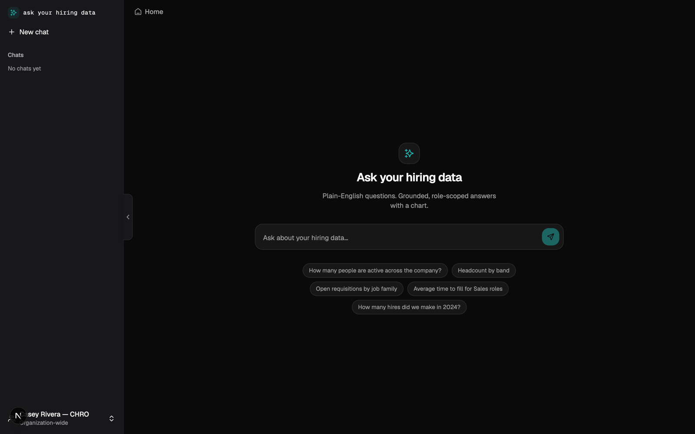
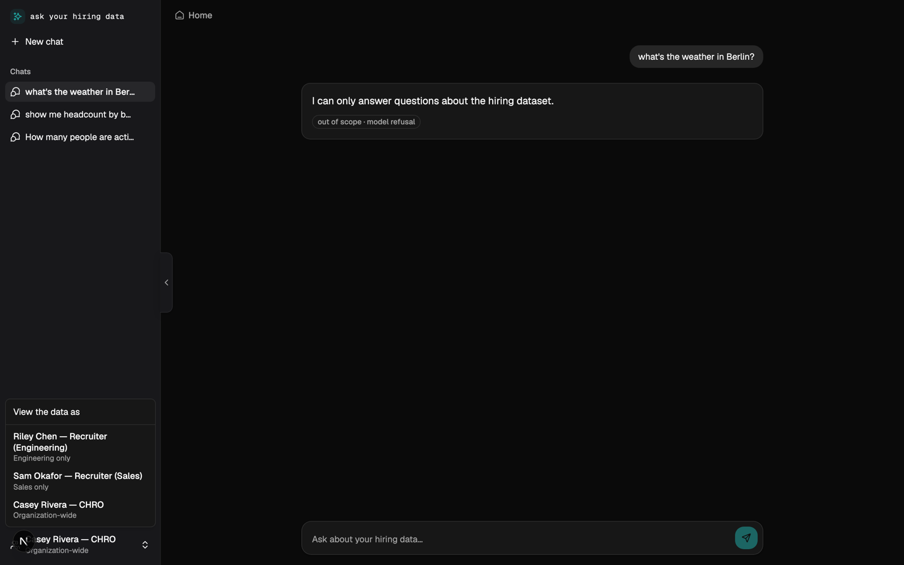
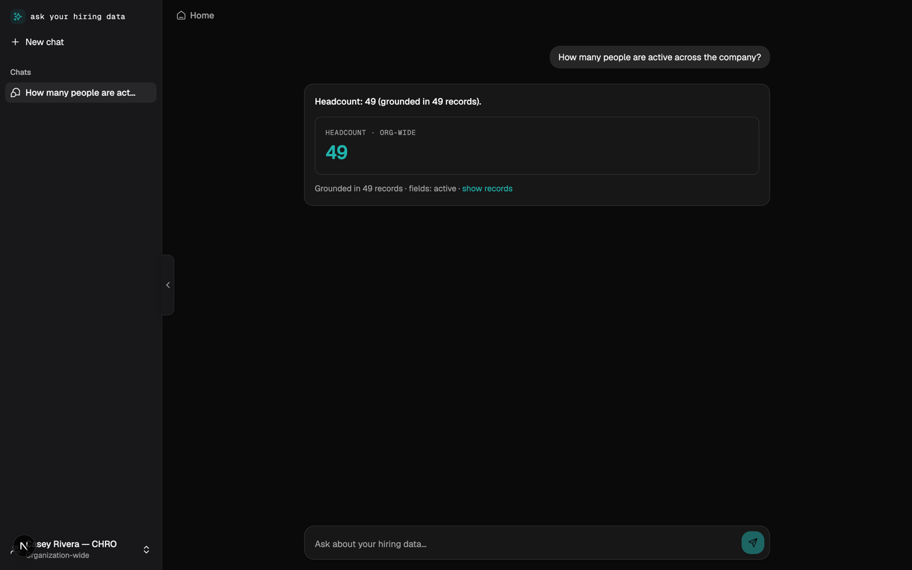
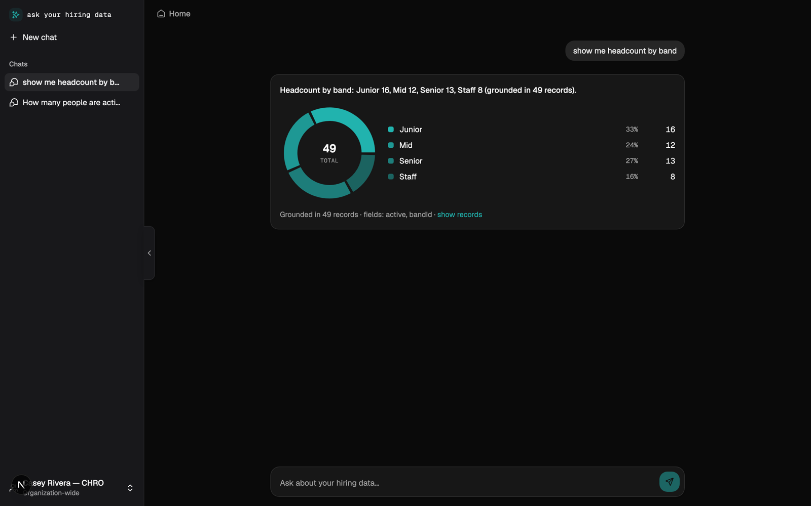
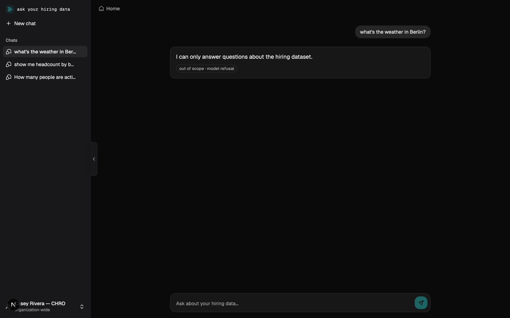
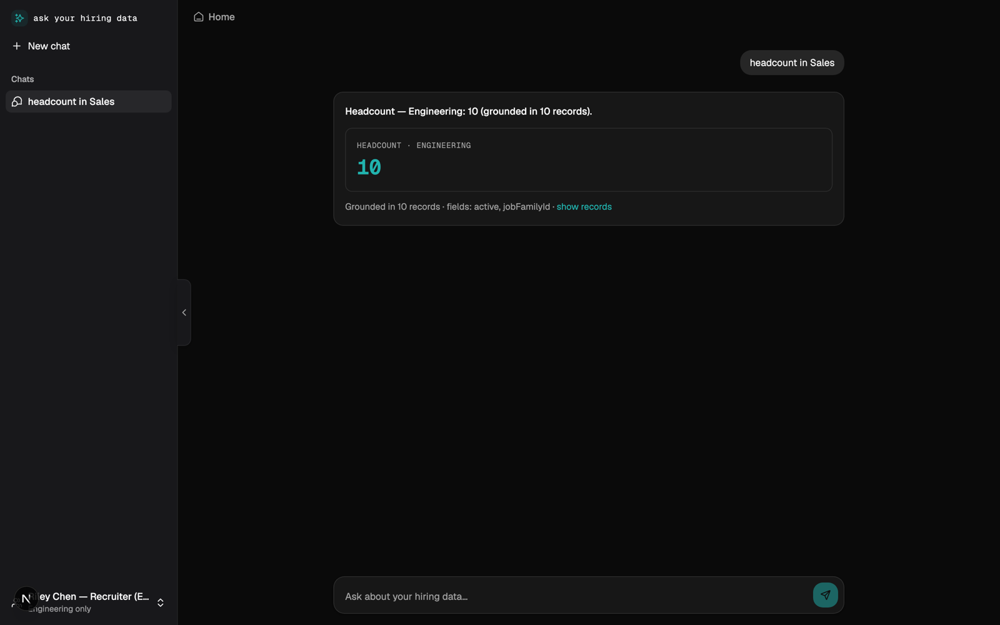
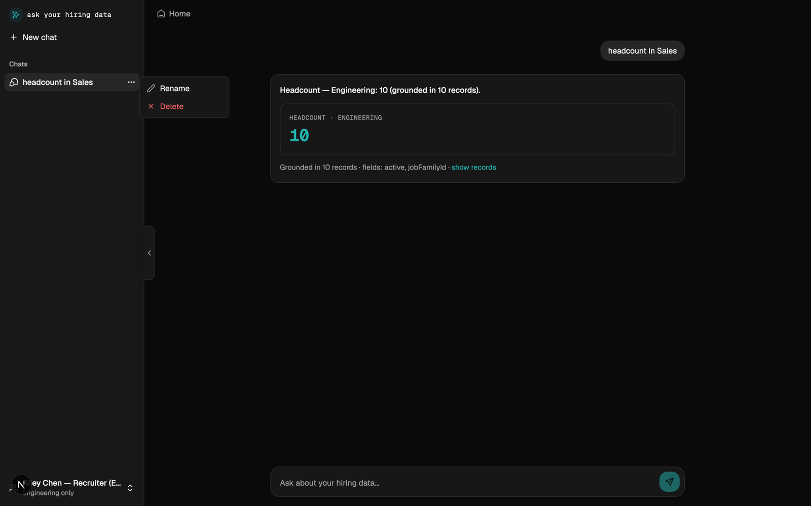
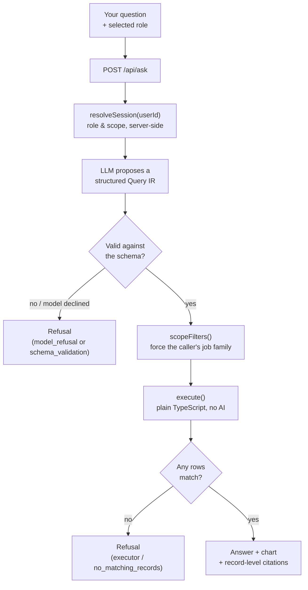

# Setup & first run

A step-by-step guide to getting **Ask Your Hiring Data** running locally and trying every
feature. No database, no API key, no accounts.

> This is the **`assessment-core`** branch — the one the take-home brief describes. The
> `main` branch is the same engine taken further into a hosted product (real auth, Postgres);
> it needs a database and is not what you need for the review.

---

## 1. Prerequisites

| Tool        | Version   | How to get it                                                                                    |
| ----------- | --------- | ------------------------------------------------------------------------------------------------ |
| **Node.js** | `>= 20.9` | [nodejs.org](https://nodejs.org) — version pinned in [`.nvmrc`](.nvmrc)                          |
| **pnpm**    | `11.x`    | `corepack enable pnpm` (Corepack ships with Node; the exact version is pinned in `package.json`) |

Check:

```bash
node -v      # v20.9.0 or higher
pnpm -v      # 11.x
```

---

## 2. Install and run

```bash
pnpm install
pnpm dev
```

That's the whole setup. Open **http://localhost:3000**.



No `.env` file is required. The app runs on a deterministic built-in stand-in for the model
(the `MockProvider`), so every answer is reproducible offline. [Section 6](#6-optional-use-the-real-openai-model)
covers switching to the real OpenAI model.

---

## 3. What you'll see

### The landing page — `/`



A one-screen explanation of the product thesis: _ask questions instead of reading a
dashboard; the model proposes a validated query, code decides._ Click **Open the assistant**
(or go to `/app`).

### The assistant — `/app`



A chat workspace modeled on Claude:

- **Left sidebar** — "New chat", your chat history (rename / delete per row), and a
  **role switcher** pinned to the bottom.
- **Centre** — the question box. It sits in the middle when a chat is empty and drops to the
  bottom once a conversation starts.

---

## 4. The three demo roles

Click the account button at the bottom of the sidebar to switch principal. Every question you
ask runs **as that person**, and the server enforces what they're allowed to see.



| Principal                          | Role        | Data scope        |
| ---------------------------------- | ----------- | ----------------- |
| **Casey Rivera** — CHRO            | `chro`      | Organization-wide |
| **Riley Chen** — Recruiter (Eng)   | `recruiter` | Engineering only  |
| **Sam Okafor** — Recruiter (Sales) | `recruiter` | Sales only        |

The role is resolved **server-side** from the selected id. The browser never sends "I am
allowed to see X" — it sends only `{ userId, question }`, and the API looks up the rest.

---

## 5. Try it — one question per outcome

### 5a. A direct answer (as CHRO)

> **How many people are active across the company?**



You get a number, a chart, a plain-English summary, and **"Grounded in N records"** with a
**show records** toggle — the exact row ids and fields the answer was computed from.

### 5b. A grouped answer (as CHRO)

> **Show me headcount by band**



Same grounding, rendered as a breakdown with a chart.

### 5c. A refusal (as CHRO)

> **What's the weather in Berlin?**



Off-topic, unsupported, ambiguous, or "no rows matched" questions get an **explicit
refusal** with a reason tag — never a made-up answer.

### 5d. The security boundary — ask outside your scope (as **Riley Chen**, Engineering)

Switch to **Riley Chen** first, then ask:

> **Headcount in Sales**



Notice the answer says **"Headcount — Engineering"**. A recruiter asking about another team is
**silently confined to their own job family** — not rejected, not shown Sales' numbers. This
is the single most important behaviour to check.

### 5e. Chat history



Chats persist in the browser (`localStorage`), separately per demo principal — switching to
Riley Chen and back to Casey Rivera keeps each person's chats distinct. Hover a row for
**rename** / **delete**.

---

## 6. Optional: use the real OpenAI model

```bash
cp .env.example .env.local
# edit .env.local and set:  OPENAI_API_KEY=sk-...
```

Restart `pnpm dev`. The provider factory detects the key and switches from the `MockProvider`
to the real model automatically. `.env.local` is git-ignored.

Everything still works without a key — the key only changes _who turns your sentence into a
structured query_, not what happens after.

---

## 7. What happens when you ask a question



The model is only ever allowed to **propose** the structured object. It never runs anything.
A separate deterministic function is the only code that touches the dataset, and role scoping
is enforced there.

---

## 8. Command reference

| Command             | What it does                                                 |
| ------------------- | ------------------------------------------------------------ |
| `pnpm dev`          | Run the app (http://localhost:3000)                          |
| `pnpm build`        | Production build                                             |
| `pnpm test`         | Vitest — unit tests **and** the 18-case eval suite as a gate |
| `pnpm eval`         | The eval suite with a readable pass/fail report              |
| `pnpm typecheck`    | `next typegen` + `tsc --noEmit`                              |
| `pnpm lint`         | ESLint                                                       |
| `pnpm format:check` | Prettier check                                               |
| `pnpm seed`         | Regenerate the synthetic dataset fixtures                    |

CI (`.github/workflows/ci.yml`) runs `format:check → lint → typecheck → test → eval → build`
on every push and PR, with no secrets.

---

## 9. Troubleshooting

| Symptom                                       | Fix                                                                                                       |
| --------------------------------------------- | --------------------------------------------------------------------------------------------------------- |
| `pnpm: command not found`                     | `corepack enable pnpm`                                                                                    |
| Wrong Node version                            | `nvm use` (reads `.nvmrc`), or install Node ≥ 20.9                                                        |
| Port 3000 in use                              | `pnpm dev -- -p 3001`                                                                                     |
| Styles look broken after editing during `dev` | Stop the server, `rm -rf .next`, `pnpm dev` again — the dev script already pins `--webpack` to avoid this |
| Want a clean slate for chat history           | Clear the site's `localStorage` in devtools, or use a private window                                      |
